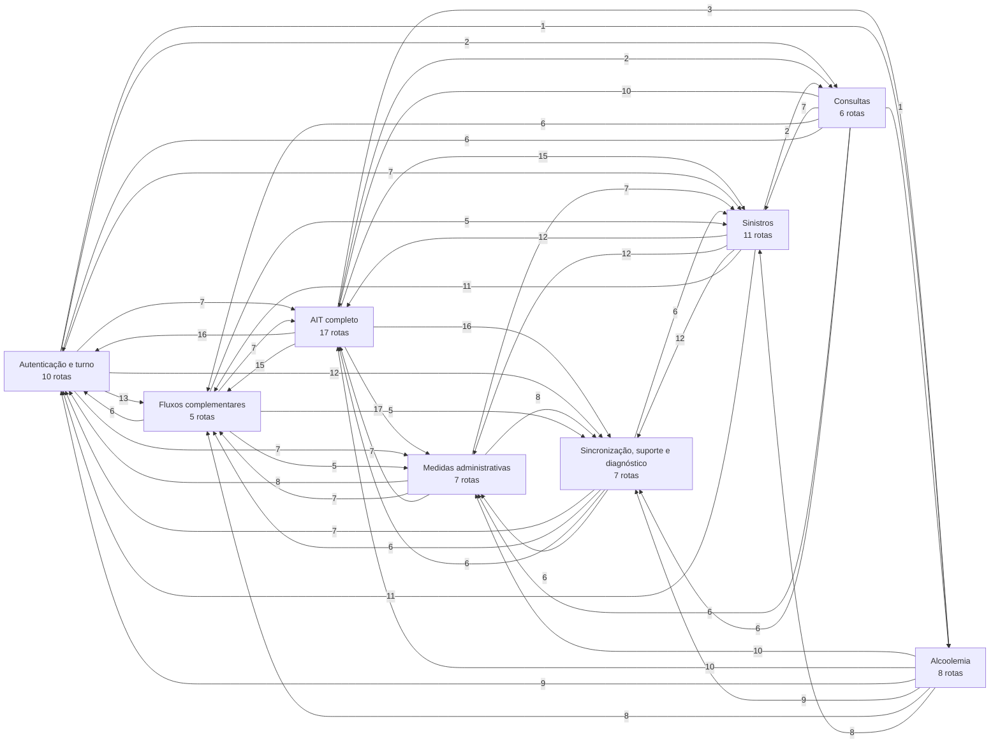

# Mapa de funcionalidades do Talonário

Gerado em Moto G20 (Android 11), 2026-09-08 a partir do build de captura (`EXPO_PUBLIC_TEAT_CAPTURE=1`, perfil `local-sandbox`, commit `7238914`). A fonte das rotas, grupos, papéis e status é `src/domain/mobile-ux-parity.registry.ts`; quem renderiza cada rota é `src/navigation/screen-registry.tsx` (`GATE_SCREENS`, `BESPOKE_SCREENS`) e `RootNavigator.tsx` (`GuidedFormScreen`/`AutoShellScreen`). As capturas vêm do sandbox offline com dados de demonstração: mostram a **tela que existe**, não dados reais.

> As capturas em tamanho original ficam fora do repositório; aqui estão reduzidas a 50 %. Rotas absorvidas ou fora do MVP no registro de deltas (`UX-PARITY-DELTAS.md`) continuam navegáveis e aparecem com o status do inventário.

## Resumo

| | |
|---|---:|
| rotas registradas | 71 |
| renderizadas por componente próprio | 40 |
| renderizadas por portão (antes do navegador) | 5 |
| renderizadas por AutoShellScreen | 4 |
| renderizadas por GuidedFormScreen | 22 |
| status `implemented` (implementada) | 45 |
| status `registered` (só navegável) | 4 |
| status `shell-functional` (formulário guiado) | 22 |
| transições registradas | 593 |
| capturas | 101 |
| rotas que abrem a mesma tela de outra rota | 18 |

Toda tela carrega o mesmo **chrome**: faixa de bodycam (UC-TEAT-010, forçada quando não há gravação confirmada), barra inferior (`home`, `ait-start`, `measure-start`, `crash-start`, `ait-history`, `sync`), ajuda contextual e "voltar". A coluna *leva a* omite esses destinos.

## Como os grupos se ligam

## Autenticação e turno

| rota | tela | uxCode | status | renderização | papéis | leva a (além do chrome) | captura |
|---|---|---|---|---|---|---|---|
| `device-incident` | Declarar incidente do aparelho anterior | UX-MOB-EXPO-003 | implementada | componente próprio (`DeviceIncidentScreen`) | field-agent, field-supervisor | `auth-login` |  |
| `auth-login` | Login | UX-MOB-001 | implementada | portão (antes do navegador) (`LoginScreen`) | field-agent, field-supervisor | `auth-mfa`, `shift-context`, `device-blocked`, `device-incident` |  |
| `auth-mfa` | MFA/Reautenticação | UX-MOB-002 | implementada | portão (antes do navegador) (`MfaScreen`) | field-agent, field-supervisor | `shift-context`, `auth-login` |  |
| `device-blocked` | Dispositivo bloqueado | UX-MOB-003 | implementada | portão (antes do navegador) (`DeviceBlockedScreen`) | field-agent, field-supervisor | (só o chrome) |  |
| `shift-context` | Selecionar unidade/equipe/viatura | UX-MOB-004 | implementada | portão (antes do navegador) (`ShiftContextScreen`) | field-agent, field-supervisor | `operation-select` |  |
| `operation-select` | Selecionar operação | UX-MOB-005 | implementada | componente próprio (`OperationSelectScreen`) | field-agent, field-supervisor | `open-shift` |  |
| `open-shift` | Abertura de turno | UX-MOB-006 | implementada | portão (antes do navegador) (`ShiftContextScreen`) | field-agent, field-supervisor | (só o chrome) | — |

```mermaid
flowchart TD
  device_incident["Declarar incidente do aparelho anterior"]
  auth_login["Login"]
  auth_mfa["MFA/Reautenticação"]
  device_blocked["Dispositivo bloqueado"]
  shift_context["Selecionar unidade/equipe/viatura"]
  operation_select["Selecionar operação"]
  open_shift["Abertura de turno"]
  home["Início do turno"]
  close_shift["Encerramento de turno"]
  shift_summary["Resumo do turno"]
  auth_login -->|"Declarar incidente do aparel"| device_incident
  home -->|"Declarar incidente do aparel"| device_incident
  device_incident -->|"Voltar e autenticar"| auth_login
  bodycam_failure(["Comunicar falha de bodycam · Sincronização, suporte e diagnóstico"])
  close_shift -->|"Comunicar falha de bodycam"| bodycam_failure
  context_help(["Ajuda contextual MBFT · Fluxos complementares"])
  auth_login -->|"Ajuda contextual"| context_help
  context_help(["Ajuda contextual MBFT · Fluxos complementares"])
  auth_mfa -->|"Ajuda contextual"| context_help
  context_help(["Ajuda contextual MBFT · Fluxos complementares"])
  device_blocked -->|"Ajuda contextual"| context_help
  context_help(["Ajuda contextual MBFT · Fluxos complementares"])
  shift_context -->|"Ajuda contextual"| context_help
  context_help(["Ajuda contextual MBFT · Fluxos complementares"])
  operation_select -->|"Ajuda contextual"| context_help
  context_help(["Ajuda contextual MBFT · Fluxos complementares"])
  open_shift -->|"Ajuda contextual"| context_help
  context_help(["Ajuda contextual MBFT · Fluxos complementares"])
  home -->|"Ajuda contextual"| context_help
  context_help(["Ajuda contextual MBFT · Fluxos complementares"])
  close_shift -->|"Ajuda contextual"| context_help
  context_help(["Ajuda contextual MBFT · Fluxos complementares"])
  shift_summary -->|"Ajuda contextual"| context_help
  auth_login -->|"Entrar"| auth_mfa
  auth_login -->|"Entrar"| shift_context
  auth_login -->|"Entrar"| device_blocked
  support(["Suporte técnico · Sincronização, suporte e diagnóstico"])
  auth_login -->|"Ajuda de acesso"| support
  auth_mfa -->|"Validar código"| shift_context
  auth_mfa -->|"Cancelar"| auth_login
  support(["Suporte técnico · Sincronização, suporte e diagnóstico"])
  device_blocked -->|"Reportar ao suporte"| support
  shift_context -->|"Continuar"| operation_select
  operation_select -->|"Continuar"| open_shift
  open_shift -->|"Abrir turno"| home
  home -->|"Encerrar turno"| close_shift
  close_shift -->|"Confirmar encerramento"| shift_summary
  shift_summary -->|"Concluir"| auth_login
  ait_start(["Novo AIT — início · AIT completo"])
  home -->|"Novo AIT"| ait_start
  vehicle_search(["Consulta de veículo · Consultas"])
  home -->|"Veículo"| vehicle_search
  driver_search(["Consulta de condutor · Consultas"])
  home -->|"Condutor"| driver_search
  measure_start(["Nova medida · Medidas administrativas"])
  home -->|"Medida"| measure_start
  alcohol_start(["Início alcoolemia · Alcoolemia"])
  home -->|"Alcoolemia"| alcohol_start
  crash_start(["Novo sinistro · Sinistros"])
  home -->|"Sinistro"| crash_start
  sync(["Fila de sincronização · Sincronização, suporte e diagnóstico"])
  home -->|"Sincronização"| sync
  diagnostics(["Diagnóstico do app · Sincronização, suporte e diagnóstico"])
  home -->|"Diagnóstico"| diagnostics
  messages(["Comunicados da operação · Sincronização, suporte e diagnóstico"])
  home -->|"Comunicados"| messages
  approach_no_ait(["Abordagem sem autuação · Fluxos complementares"])
  home -->|"Abordagem sem autuação"| approach_no_ait
  document_check(["Fiscalização documental · Fluxos complementares"])
  home -->|"Fiscalização documental"| document_check
  special_inspection(["Fiscalização de carga/equipamento · Fluxos complementares"])
  home -->|"Carga/equipamento"| special_inspection
  local_settings(["Configurações locais · Fluxos complementares"])
  home -->|"Configurações"| local_settings
  shift_context -->|"Nav Início"| home
  ait_start(["Novo AIT — início · AIT completo"])
  shift_context -->|"Nav AIT"| ait_start
  measure_start(["Nova medida · Medidas administrativas"])
  shift_context -->|"Nav Medidas"| measure_start
  crash_start(["Novo sinistro · Sinistros"])
  shift_context -->|"Nav Sinistro"| crash_start
  sync(["Fila de sincronização · Sincronização, suporte e diagnóstico"])
  shift_context -->|"Nav Sync"| sync
  operation_select -->|"Nav Início"| home
  ait_start(["Novo AIT — início · AIT completo"])
  operation_select -->|"Nav AIT"| ait_start
  measure_start(["Nova medida · Medidas administrativas"])
  operation_select -->|"Nav Medidas"| measure_start
  crash_start(["Novo sinistro · Sinistros"])
  operation_select -->|"Nav Sinistro"| crash_start
  sync(["Fila de sincronização · Sincronização, suporte e diagnóstico"])
  operation_select -->|"Nav Sync"| sync
  ait_start(["Novo AIT — início · AIT completo"])
  open_shift -->|"Nav AIT"| ait_start
  measure_start(["Nova medida · Medidas administrativas"])
  open_shift -->|"Nav Medidas"| measure_start
  crash_start(["Novo sinistro · Sinistros"])
  open_shift -->|"Nav Sinistro"| crash_start
  sync(["Fila de sincronização · Sincronização, suporte e diagnóstico"])
  open_shift -->|"Nav Sync"| sync
  close_shift -->|"Nav Início"| home
  ait_start(["Novo AIT — início · AIT completo"])
  close_shift -->|"Nav AIT"| ait_start
  measure_start(["Nova medida · Medidas administrativas"])
  close_shift -->|"Nav Medidas"| measure_start
  crash_start(["Novo sinistro · Sinistros"])
  close_shift -->|"Nav Sinistro"| crash_start
  sync(["Fila de sincronização · Sincronização, suporte e diagnóstico"])
  close_shift -->|"Nav Sync"| sync
  shift_summary -->|"Nav Início"| home
  ait_start(["Novo AIT — início · AIT completo"])
  shift_summary -->|"Nav AIT"| ait_start
  measure_start(["Nova medida · Medidas administrativas"])
  shift_summary -->|"Nav Medidas"| measure_start
  crash_start(["Novo sinistro · Sinistros"])
  shift_summary -->|"Nav Sinistro"| crash_start
  sync(["Fila de sincronização · Sincronização, suporte e diagnóstico"])
  shift_summary -->|"Nav Sync"| sync
```

| `home` | Início do turno | UX-MOB-007 | implementada | componente próprio (`HomeScreen`) | field-agent, field-supervisor | `close-shift`, `alcohol-start`, `diagnostics`, `messages`, `approach-no-ait`, `document-check`, `special-inspection`, `local-settings`, `device-incident` |  |
| `close-shift` | Encerramento de turno | UX-MOB-008 | implementada | componente próprio (`ShiftSummaryScreen`) | field-agent, field-supervisor | `shift-summary` |  |
| `shift-summary` | Resumo do turno — **mesma tela que `close-shift`** | UX-MOB-009 | implementada | componente próprio (`ShiftSummaryScreen`) | field-agent, field-supervisor | `auth-login` |  |

## AIT completo

| rota | tela | uxCode | status | renderização | papéis | leva a (além do chrome) | captura |
|---|---|---|---|---|---|---|---|
| `ait-history` | Autos lavrados | UX-MOB-EXPO-001 | implementada | componente próprio (`AitHistoryScreen`) | field-agent, field-supervisor | `ait-cancel-posfinal`, `alcohol-links` |  |
| `ait-cancel-posfinal` | Solicitar cancelamento pós-finalização | UX-MOB-EXPO-002 | implementada | componente próprio (`AitCancelRequestScreen`) | field-agent, field-supervisor | (só o chrome) |  |
| `ait-start` | Novo AIT — início | UX-MOB-020 | implementada | componente próprio (`AitFlowScreen`) | field-agent, field-supervisor | `ait-vehicle`, `ait-vehicle`, `ait-vehicle`, `alcohol-links` |  |
| `ait-vehicle` | AIT — veículo | UX-MOB-021 | formulário guiado | GuidedFormScreen (`GuidedFormScreen`) | field-agent, field-supervisor | `ait-driver` |  |
| `ait-driver` | AIT — condutor/infrator | UX-MOB-022 | formulário guiado | GuidedFormScreen (`GuidedFormScreen`) | field-agent, field-supervisor | `ait-frame` |  |
| `ait-frame` | AIT — enquadramento — **mesma tela que `ait-start`** | UX-MOB-023 | implementada | componente próprio (`AitFlowScreen`) | field-agent, field-supervisor | `ait-frame-detail`, `ait-frame-detail` |  |
| `ait-frame-detail` | AIT — detalhe do enquadramento — **mesma tela que `ait-start`** | UX-MOB-024 | implementada | componente próprio (`AitFlowScreen`) | field-agent, field-supervisor | `ait-location`, `ait-location` |  |
| `ait-location` | AIT — local | UX-MOB-025 | formulário guiado | GuidedFormScreen (`GuidedFormScreen`) | field-agent, field-supervisor | `ait-notes` |  |
| `ait-notes` | AIT — observações | UX-MOB-026 | formulário guiado | GuidedFormScreen (`GuidedFormScreen`) | field-agent, field-supervisor | `ait-validations` |  |
| `ait-validations` | AIT — validações | UX-MOB-027 | formulário guiado | GuidedFormScreen (`GuidedFormScreen`) | field-agent, field-supervisor | `ait-evidence`, `ait-notes`, `ait-location`, `ait-frame` |  |
| `ait-evidence` | AIT — evidências | UX-MOB-028 | formulário guiado | GuidedFormScreen (`GuidedFormScreen`) | field-agent, field-supervisor | `ait-measures` |  |
| `ait-measures` | AIT — medidas sugeridas | UX-MOB-029 | formulário guiado | GuidedFormScreen (`GuidedFormScreen`) | field-agent, field-supervisor | `ait-signature`, `retention`, `removal`, `alcohol-start` |  |
| `ait-signature` | AIT — assinatura/ciência — **mesma tela que `ait-start`** | UX-MOB-030 | implementada | componente próprio (`AitFlowScreen`) | field-agent, field-supervisor | `ait-review` |  |
| `ait-review` | AIT — revisão final | UX-MOB-031 | formulário guiado | GuidedFormScreen (`GuidedFormScreen`) | field-agent, field-supervisor | `ait-done`, `ait-done`, `ait-validations` |  |
| `ait-done` | AIT — finalizado | UX-MOB-032 | só navegável | AutoShellScreen (`AutoShellScreen`) | field-agent, field-supervisor | `ait-print`, `ait-shift-detail` |  |
| `ait-print` | AIT — impressão — **mesma tela que `ait-history`** | UX-MOB-033 | implementada | componente próprio (`AitHistoryScreen`) | field-agent, field-supervisor | `ait-done`, `ait-print` |  |
| `ait-shift-detail` | AIT — detalhes do turno | UX-MOB-034 | formulário guiado | GuidedFormScreen (`GuidedFormScreen`) | field-agent, field-supervisor | (só o chrome) |  |

```mermaid
flowchart TD
  ait_history["Autos lavrados"]
  ait_cancel_posfinal["Solicitar cancelamento pós-finalização"]
  ait_start["Novo AIT — início"]
  ait_vehicle["AIT — veículo"]
  ait_driver["AIT — condutor/infrator"]
  ait_frame["AIT — enquadramento"]
  ait_frame_detail["AIT — detalhe do enquadramento"]
  ait_location["AIT — local"]
  ait_notes["AIT — observações"]
  ait_validations["AIT — validações"]
  ait_evidence["AIT — evidências"]
  ait_measures["AIT — medidas sugeridas"]
  ait_signature["AIT — assinatura/ciência"]
  ait_review["AIT — revisão final"]
  ait_done["AIT — finalizado"]
  ait_print["AIT — impressão"]
  ait_shift_detail["AIT — detalhes do turno"]
  alcohol_links(["AIT/medidas vinculadas · Alcoolemia"])
  ait_start -->|"Condutor substituto / medida"| alcohol_links
  alcohol_links(["AIT/medidas vinculadas · Alcoolemia"])
  ait_history -->|"Medidas vinculadas / conduto"| alcohol_links
  ait_history -->|"Solicitar cancelamento pós-f"| ait_cancel_posfinal
  ait_cancel_posfinal -->|"Submeter solicitação à Diret"| ait_cancel_posfinal
  ait_cancel_posfinal -->|"Voltar aos autos lavrados"| ait_history
  context_help(["Ajuda contextual MBFT · Fluxos complementares"])
  ait_start -->|"Ajuda contextual"| context_help
  context_help(["Ajuda contextual MBFT · Fluxos complementares"])
  ait_vehicle -->|"Ajuda contextual"| context_help
  context_help(["Ajuda contextual MBFT · Fluxos complementares"])
  ait_driver -->|"Ajuda contextual"| context_help
  context_help(["Ajuda contextual MBFT · Fluxos complementares"])
  ait_frame -->|"Ajuda contextual"| context_help
  context_help(["Ajuda contextual MBFT · Fluxos complementares"])
  ait_frame_detail -->|"Ajuda contextual"| context_help
  context_help(["Ajuda contextual MBFT · Fluxos complementares"])
  ait_location -->|"Ajuda contextual"| context_help
  context_help(["Ajuda contextual MBFT · Fluxos complementares"])
  ait_notes -->|"Ajuda contextual"| context_help
  context_help(["Ajuda contextual MBFT · Fluxos complementares"])
  ait_validations -->|"Ajuda contextual"| context_help
  context_help(["Ajuda contextual MBFT · Fluxos complementares"])
  ait_evidence -->|"Ajuda contextual"| context_help
  context_help(["Ajuda contextual MBFT · Fluxos complementares"])
  ait_measures -->|"Ajuda contextual"| context_help
  context_help(["Ajuda contextual MBFT · Fluxos complementares"])
  ait_signature -->|"Ajuda contextual"| context_help
  context_help(["Ajuda contextual MBFT · Fluxos complementares"])
  ait_review -->|"Ajuda contextual"| context_help
  context_help(["Ajuda contextual MBFT · Fluxos complementares"])
  ait_done -->|"Ajuda contextual"| context_help
  context_help(["Ajuda contextual MBFT · Fluxos complementares"])
  ait_print -->|"Ajuda contextual"| context_help
  context_help(["Ajuda contextual MBFT · Fluxos complementares"])
  ait_shift_detail -->|"Ajuda contextual"| context_help
  home(["Início do turno · Autenticação e turno"])
  ait_start -->|"Nav Início"| home
  measure_start(["Nova medida · Medidas administrativas"])
  ait_start -->|"Nav Medidas"| measure_start
  crash_start(["Novo sinistro · Sinistros"])
  ait_start -->|"Nav Sinistro"| crash_start
  sync(["Fila de sincronização · Sincronização, suporte e diagnóstico"])
  ait_start -->|"Nav Sync"| sync
  home(["Início do turno · Autenticação e turno"])
  ait_vehicle -->|"Nav Início"| home
  ait_vehicle -->|"Nav AIT"| ait_start
  measure_start(["Nova medida · Medidas administrativas"])
  ait_vehicle -->|"Nav Medidas"| measure_start
  crash_start(["Novo sinistro · Sinistros"])
  ait_vehicle -->|"Nav Sinistro"| crash_start
  sync(["Fila de sincronização · Sincronização, suporte e diagnóstico"])
  ait_vehicle -->|"Nav Sync"| sync
  home(["Início do turno · Autenticação e turno"])
  ait_driver -->|"Nav Início"| home
  ait_driver -->|"Nav AIT"| ait_start
  measure_start(["Nova medida · Medidas administrativas"])
  ait_driver -->|"Nav Medidas"| measure_start
  crash_start(["Novo sinistro · Sinistros"])
  ait_driver -->|"Nav Sinistro"| crash_start
  sync(["Fila de sincronização · Sincronização, suporte e diagnóstico"])
  ait_driver -->|"Nav Sync"| sync
  home(["Início do turno · Autenticação e turno"])
  ait_frame -->|"Nav Início"| home
  ait_frame -->|"Nav AIT"| ait_start
  measure_start(["Nova medida · Medidas administrativas"])
  ait_frame -->|"Nav Medidas"| measure_start
  crash_start(["Novo sinistro · Sinistros"])
  ait_frame -->|"Nav Sinistro"| crash_start
  sync(["Fila de sincronização · Sincronização, suporte e diagnóstico"])
  ait_frame -->|"Nav Sync"| sync
  home(["Início do turno · Autenticação e turno"])
  ait_frame_detail -->|"Nav Início"| home
  ait_frame_detail -->|"Nav AIT"| ait_start
  measure_start(["Nova medida · Medidas administrativas"])
  ait_frame_detail -->|"Nav Medidas"| measure_start
  crash_start(["Novo sinistro · Sinistros"])
  ait_frame_detail -->|"Nav Sinistro"| crash_start
  sync(["Fila de sincronização · Sincronização, suporte e diagnóstico"])
  ait_frame_detail -->|"Nav Sync"| sync
  home(["Início do turno · Autenticação e turno"])
  ait_location -->|"Nav Início"| home
  ait_location -->|"Nav AIT"| ait_start
  measure_start(["Nova medida · Medidas administrativas"])
  ait_location -->|"Nav Medidas"| measure_start
  crash_start(["Novo sinistro · Sinistros"])
  ait_location -->|"Nav Sinistro"| crash_start
  sync(["Fila de sincronização · Sincronização, suporte e diagnóstico"])
  ait_location -->|"Nav Sync"| sync
  home(["Início do turno · Autenticação e turno"])
  ait_notes -->|"Nav Início"| home
  ait_notes -->|"Nav AIT"| ait_start
  measure_start(["Nova medida · Medidas administrativas"])
  ait_notes -->|"Nav Medidas"| measure_start
  crash_start(["Novo sinistro · Sinistros"])
  ait_notes -->|"Nav Sinistro"| crash_start
  sync(["Fila de sincronização · Sincronização, suporte e diagnóstico"])
  ait_notes -->|"Nav Sync"| sync
  home(["Início do turno · Autenticação e turno"])
  ait_validations -->|"Nav Início"| home
  ait_validations -->|"Nav AIT"| ait_start
  measure_start(["Nova medida · Medidas administrativas"])
  ait_validations -->|"Nav Medidas"| measure_start
  crash_start(["Novo sinistro · Sinistros"])
  ait_validations -->|"Nav Sinistro"| crash_start
  sync(["Fila de sincronização · Sincronização, suporte e diagnóstico"])
  ait_validations -->|"Nav Sync"| sync
  home(["Início do turno · Autenticação e turno"])
  ait_evidence -->|"Nav Início"| home
  ait_evidence -->|"Nav AIT"| ait_start
  measure_start(["Nova medida · Medidas administrativas"])
  ait_evidence -->|"Nav Medidas"| measure_start
  crash_start(["Novo sinistro · Sinistros"])
  ait_evidence -->|"Nav Sinistro"| crash_start
  sync(["Fila de sincronização · Sincronização, suporte e diagnóstico"])
  ait_evidence -->|"Nav Sync"| sync
  home(["Início do turno · Autenticação e turno"])
  ait_measures -->|"Nav Início"| home
  ait_measures -->|"Nav AIT"| ait_start
  measure_start(["Nova medida · Medidas administrativas"])
  ait_measures -->|"Nav Medidas"| measure_start
  crash_start(["Novo sinistro · Sinistros"])
  ait_measures -->|"Nav Sinistro"| crash_start
  sync(["Fila de sincronização · Sincronização, suporte e diagnóstico"])
  ait_measures -->|"Nav Sync"| sync
  home(["Início do turno · Autenticação e turno"])
  ait_signature -->|"Nav Início"| home
  ait_signature -->|"Nav AIT"| ait_start
  measure_start(["Nova medida · Medidas administrativas"])
  ait_signature -->|"Nav Medidas"| measure_start
  crash_start(["Novo sinistro · Sinistros"])
  ait_signature -->|"Nav Sinistro"| crash_start
  sync(["Fila de sincronização · Sincronização, suporte e diagnóstico"])
  ait_signature -->|"Nav Sync"| sync
  home(["Início do turno · Autenticação e turno"])
  ait_review -->|"Nav Início"| home
  ait_review -->|"Nav AIT"| ait_start
  measure_start(["Nova medida · Medidas administrativas"])
  ait_review -->|"Nav Medidas"| measure_start
  crash_start(["Novo sinistro · Sinistros"])
  ait_review -->|"Nav Sinistro"| crash_start
  sync(["Fila de sincronização · Sincronização, suporte e diagnóstico"])
  ait_review -->|"Nav Sync"| sync
  home(["Início do turno · Autenticação e turno"])
  ait_done -->|"Nav Início"| home
  ait_done -->|"Nav AIT"| ait_start
  measure_start(["Nova medida · Medidas administrativas"])
  ait_done -->|"Nav Medidas"| measure_start
  crash_start(["Novo sinistro · Sinistros"])
  ait_done -->|"Nav Sinistro"| crash_start
  sync(["Fila de sincronização · Sincronização, suporte e diagnóstico"])
  ait_done -->|"Nav Sync"| sync
  home(["Início do turno · Autenticação e turno"])
  ait_print -->|"Nav Início"| home
  ait_print -->|"Nav AIT"| ait_start
  measure_start(["Nova medida · Medidas administrativas"])
  ait_print -->|"Nav Medidas"| measure_start
  crash_start(["Novo sinistro · Sinistros"])
  ait_print -->|"Nav Sinistro"| crash_start
  sync(["Fila de sincronização · Sincronização, suporte e diagnóstico"])
  ait_print -->|"Nav Sync"| sync
  home(["Início do turno · Autenticação e turno"])
  ait_shift_detail -->|"Nav Início"| home
  ait_shift_detail -->|"Nav AIT"| ait_start
  measure_start(["Nova medida · Medidas administrativas"])
  ait_shift_detail -->|"Nav Medidas"| measure_start
  crash_start(["Novo sinistro · Sinistros"])
  ait_shift_detail -->|"Nav Sinistro"| crash_start
  sync(["Fila de sincronização · Sincronização, suporte e diagnóstico"])
  ait_shift_detail -->|"Nav Sync"| sync
  ait_start -->|"Continuar"| ait_vehicle
  ait_vehicle -->|"Continuar"| ait_driver
  ait_driver -->|"Continuar"| ait_frame
  ait_frame -->|"Continuar"| ait_frame_detail
  ait_frame_detail -->|"Continuar"| ait_location
  ait_location -->|"Continuar"| ait_notes
  ait_notes -->|"Continuar"| ait_validations
  ait_validations -->|"Continuar"| ait_evidence
  ait_evidence -->|"Continuar"| ait_measures
  ait_measures -->|"Continuar"| ait_signature
  ait_signature -->|"Continuar"| ait_review
  ait_review -->|"Continuar"| ait_done
  vehicle_search(["Consulta de veículo · Consultas"])
  ait_vehicle -->|"Consultar veículo"| vehicle_search
  driver_search(["Consulta de condutor · Consultas"])
  ait_driver -->|"Consultar condutor"| driver_search
  ait_validations -->|"Corrigir bloqueios"| ait_notes
  ait_validations -->|"Corrigir localização"| ait_location
  ait_validations -->|"Corrigir enquadramento"| ait_frame
  retention(["Retenção · Medidas administrativas"])
  ait_measures -->|"Criar retenção"| retention
  removal(["Remoção · Medidas administrativas"])
  ait_measures -->|"Criar remoção"| removal
  alcohol_start(["Início alcoolemia · Alcoolemia"])
  ait_measures -->|"Criar alcoolemia"| alcohol_start
  ait_review -->|"Voltar e revisar"| ait_validations
  ait_done -->|"Imprimir"| ait_print
  ait_done -->|"Ver detalhes"| ait_shift_detail
  ait_print -->|"Registrar falha de impressão"| ait_done
  ait_print -->|"Reimprimir"| ait_print
```

### Passos do assistente `ait-start` (Novo AIT — início)

        

| passo | textos visíveis |
|---|---|
| `vehicle` | Nova autuação · AIT previsto nº 1000 · Veículo · Placa |
| `driver` | Nova autuação · AIT previsto nº 1000 · Condutor · Papel |
| `alcohol` | Nova autuação · AIT previsto nº 1000 · Alcoolemia · Procedimento de verificação de influência de álcool |
| `frame` | Nova autuação · AIT previsto nº 1000 · Enquadramento · Busque por artigo ou descrição |
| `location` | Nova autuação · AIT previsto nº 1000 · Local · Nenhuma localização capturada ainda. |
| `evidence` | Nova autuação · AIT previsto nº 1000 · Evidência · 0/5 fotos · até 5. |
| `signature` | Nova autuação · AIT previsto nº 1000 · Ciência do infrator · Resultado da ciência (registre exatamente um) |
| `review` | Nova autuação · AIT previsto nº 1000 · Revisão · Placa |
| `done` | Nova autuação · Finalizado |

## Alcoolemia

| rota | tela | uxCode | status | renderização | papéis | leva a (além do chrome) | captura |
|---|---|---|---|---|---|---|---|
| `alcohol-start` | Início alcoolemia — **mesma tela que `ait-start`** | UX-MOB-050 | implementada | componente próprio (`AitFlowScreen`) | field-agent, field-supervisor | (só o chrome) |  |
| `alcohol-device` | Etilômetro — **mesma tela que `ait-start`** | UX-MOB-051 | implementada | componente próprio (`AitFlowScreen`) | field-agent, field-supervisor | (só o chrome) |  |
| `alcohol-result` | Resultado do teste — **mesma tela que `ait-start`** | UX-MOB-052 | implementada | componente próprio (`AitFlowScreen`) | field-agent, field-supervisor | (só o chrome) |  |
| `alcohol-refusal` | Recusa — **mesma tela que `ait-start`** | UX-MOB-053 | implementada | componente próprio (`AitFlowScreen`) | field-agent, field-supervisor | (só o chrome) |  |
| `alcohol-signs` | Sinais psicomotores — **mesma tela que `ait-start`** | UX-MOB-054 | implementada | componente próprio (`AitFlowScreen`) | field-agent, field-supervisor | (só o chrome) |  |
| `alcohol-forward` | Encaminhamento — **mesma tela que `ait-start`** | UX-MOB-055 | implementada | componente próprio (`AitFlowScreen`) | field-agent, field-supervisor | (só o chrome) |  |
| `alcohol-links` | AIT/medidas vinculadas | UX-MOB-056 | implementada | componente próprio (`AlcoholBoundMeasuresScreen`) | field-agent, field-supervisor | `alcohol-start` |  |
| `alcohol-term` | Termo de alcoolemia — **mesma tela que `ait-start`** | UX-MOB-057 | implementada | componente próprio (`AitFlowScreen`) | field-agent, field-supervisor | (só o chrome) |  |

```mermaid
flowchart TD
  alcohol_start["Início alcoolemia"]
  alcohol_device["Etilômetro"]
  alcohol_result["Resultado do teste"]
  alcohol_refusal["Recusa"]
  alcohol_signs["Sinais psicomotores"]
  alcohol_forward["Encaminhamento"]
  alcohol_links["AIT/medidas vinculadas"]
  alcohol_term["Termo de alcoolemia"]
  measure_start(["Nova medida · Medidas administrativas"])
  alcohol_links -->|"Registrar medida vinculada ("| measure_start
  alcohol_links -->|"Lavrar auto sobre o condutor"| alcohol_start
  context_help(["Ajuda contextual MBFT · Fluxos complementares"])
  alcohol_start -->|"Ajuda contextual"| context_help
  context_help(["Ajuda contextual MBFT · Fluxos complementares"])
  alcohol_device -->|"Ajuda contextual"| context_help
  context_help(["Ajuda contextual MBFT · Fluxos complementares"])
  alcohol_result -->|"Ajuda contextual"| context_help
  context_help(["Ajuda contextual MBFT · Fluxos complementares"])
  alcohol_refusal -->|"Ajuda contextual"| context_help
  context_help(["Ajuda contextual MBFT · Fluxos complementares"])
  alcohol_signs -->|"Ajuda contextual"| context_help
  context_help(["Ajuda contextual MBFT · Fluxos complementares"])
  alcohol_forward -->|"Ajuda contextual"| context_help
  context_help(["Ajuda contextual MBFT · Fluxos complementares"])
  alcohol_links -->|"Ajuda contextual"| context_help
  context_help(["Ajuda contextual MBFT · Fluxos complementares"])
  alcohol_term -->|"Ajuda contextual"| context_help
  home(["Início do turno · Autenticação e turno"])
  alcohol_start -->|"Nav Início"| home
  ait_start(["Novo AIT — início · AIT completo"])
  alcohol_start -->|"Nav AIT"| ait_start
  measure_start(["Nova medida · Medidas administrativas"])
  alcohol_start -->|"Nav Medidas"| measure_start
  crash_start(["Novo sinistro · Sinistros"])
  alcohol_start -->|"Nav Sinistro"| crash_start
  sync(["Fila de sincronização · Sincronização, suporte e diagnóstico"])
  alcohol_start -->|"Nav Sync"| sync
  home(["Início do turno · Autenticação e turno"])
  alcohol_device -->|"Nav Início"| home
  ait_start(["Novo AIT — início · AIT completo"])
  alcohol_device -->|"Nav AIT"| ait_start
  measure_start(["Nova medida · Medidas administrativas"])
  alcohol_device -->|"Nav Medidas"| measure_start
  crash_start(["Novo sinistro · Sinistros"])
  alcohol_device -->|"Nav Sinistro"| crash_start
  sync(["Fila de sincronização · Sincronização, suporte e diagnóstico"])
  alcohol_device -->|"Nav Sync"| sync
  home(["Início do turno · Autenticação e turno"])
  alcohol_result -->|"Nav Início"| home
  ait_start(["Novo AIT — início · AIT completo"])
  alcohol_result -->|"Nav AIT"| ait_start
  measure_start(["Nova medida · Medidas administrativas"])
  alcohol_result -->|"Nav Medidas"| measure_start
  crash_start(["Novo sinistro · Sinistros"])
  alcohol_result -->|"Nav Sinistro"| crash_start
  sync(["Fila de sincronização · Sincronização, suporte e diagnóstico"])
  alcohol_result -->|"Nav Sync"| sync
  home(["Início do turno · Autenticação e turno"])
  alcohol_refusal -->|"Nav Início"| home
  ait_start(["Novo AIT — início · AIT completo"])
  alcohol_refusal -->|"Nav AIT"| ait_start
  measure_start(["Nova medida · Medidas administrativas"])
  alcohol_refusal -->|"Nav Medidas"| measure_start
  crash_start(["Novo sinistro · Sinistros"])
  alcohol_refusal -->|"Nav Sinistro"| crash_start
  sync(["Fila de sincronização · Sincronização, suporte e diagnóstico"])
  alcohol_refusal -->|"Nav Sync"| sync
  home(["Início do turno · Autenticação e turno"])
  alcohol_signs -->|"Nav Início"| home
  ait_start(["Novo AIT — início · AIT completo"])
  alcohol_signs -->|"Nav AIT"| ait_start
  measure_start(["Nova medida · Medidas administrativas"])
  alcohol_signs -->|"Nav Medidas"| measure_start
  crash_start(["Novo sinistro · Sinistros"])
  alcohol_signs -->|"Nav Sinistro"| crash_start
  sync(["Fila de sincronização · Sincronização, suporte e diagnóstico"])
  alcohol_signs -->|"Nav Sync"| sync
  home(["Início do turno · Autenticação e turno"])
  alcohol_forward -->|"Nav Início"| home
  ait_start(["Novo AIT — início · AIT completo"])
  alcohol_forward -->|"Nav AIT"| ait_start
  measure_start(["Nova medida · Medidas administrativas"])
  alcohol_forward -->|"Nav Medidas"| measure_start
  crash_start(["Novo sinistro · Sinistros"])
  alcohol_forward -->|"Nav Sinistro"| crash_start
  sync(["Fila de sincronização · Sincronização, suporte e diagnóstico"])
  alcohol_forward -->|"Nav Sync"| sync
  home(["Início do turno · Autenticação e turno"])
  alcohol_links -->|"Nav Início"| home
  ait_start(["Novo AIT — início · AIT completo"])
  alcohol_links -->|"Nav AIT"| ait_start
  crash_start(["Novo sinistro · Sinistros"])
  alcohol_links -->|"Nav Sinistro"| crash_start
  sync(["Fila de sincronização · Sincronização, suporte e diagnóstico"])
  alcohol_links -->|"Nav Sync"| sync
  home(["Início do turno · Autenticação e turno"])
  alcohol_term -->|"Nav Início"| home
  ait_start(["Novo AIT — início · AIT completo"])
  alcohol_term -->|"Nav AIT"| ait_start
  measure_start(["Nova medida · Medidas administrativas"])
  alcohol_term -->|"Nav Medidas"| measure_start
  crash_start(["Novo sinistro · Sinistros"])
  alcohol_term -->|"Nav Sinistro"| crash_start
  sync(["Fila de sincronização · Sincronização, suporte e diagnóstico"])
  alcohol_term -->|"Nav Sync"| sync
  alcohol_start -->|"Selecionar teste"| alcohol_device
  alcohol_start -->|"Selecionar recusa"| alcohol_refusal
  alcohol_start -->|"Selecionar sinais"| alcohol_signs
  alcohol_device -->|"Continuar"| alcohol_result
  alcohol_result -->|"Salvar procedimento"| alcohol_links
  alcohol_refusal -->|"Gerar termo"| alcohol_term
  alcohol_signs -->|"Continuar"| alcohol_links
  alcohol_forward -->|"Continuar"| alcohol_links
  retention(["Retenção · Medidas administrativas"])
  alcohol_links -->|"Criar/vincular medida"| retention
  alcohol_links -->|"Gerar termo"| alcohol_term
```

## Medidas administrativas

| rota | tela | uxCode | status | renderização | papéis | leva a (além do chrome) | captura |
|---|---|---|---|---|---|---|---|
| `measure-start` | Nova medida | UX-MOB-040 | implementada | componente próprio (`MeasureFlowScreen`) | field-agent, field-supervisor | `retention`, `removal`, `transshipment` |  |
| `retention` | Retenção — **mesma tela que `measure-start`** | UX-MOB-041 | implementada | componente próprio (`MeasureFlowScreen`) | field-agent, field-supervisor | `measure-term`, `measure-done` |  |
| `removal` | Remoção — **mesma tela que `measure-start`** | UX-MOB-042 | implementada | componente próprio (`MeasureFlowScreen`) | field-agent, field-supervisor | `inventory` |  |
| `inventory` | Inventário — **mesma tela que `measure-start`** | UX-MOB-043 | implementada | componente próprio (`MeasureFlowScreen`) | field-agent, field-supervisor | `measure-term` |  |
| `transshipment` | Transbordo — **mesma tela que `measure-start`** | UX-MOB-044 | implementada | componente próprio (`MeasureFlowScreen`) | field-agent, field-supervisor | `measure-term` |  |
| `measure-term` | Termo administrativo — **mesma tela que `measure-start`** | UX-MOB-045 | implementada | componente próprio (`MeasureFlowScreen`) | field-agent, field-supervisor | `measure-done` |  |
| `measure-done` | Finalização da medida — **mesma tela que `measure-start`** | UX-MOB-046 | implementada | componente próprio (`MeasureFlowScreen`) | field-agent, field-supervisor | (só o chrome) |  |

```mermaid
flowchart TD
  measure_start["Nova medida"]
  retention["Retenção"]
  removal["Remoção"]
  inventory["Inventário"]
  transshipment["Transbordo"]
  measure_term["Termo administrativo"]
  measure_done["Finalização da medida"]
  context_help(["Ajuda contextual MBFT · Fluxos complementares"])
  measure_start -->|"Ajuda contextual"| context_help
  context_help(["Ajuda contextual MBFT · Fluxos complementares"])
  retention -->|"Ajuda contextual"| context_help
  context_help(["Ajuda contextual MBFT · Fluxos complementares"])
  removal -->|"Ajuda contextual"| context_help
  context_help(["Ajuda contextual MBFT · Fluxos complementares"])
  inventory -->|"Ajuda contextual"| context_help
  context_help(["Ajuda contextual MBFT · Fluxos complementares"])
  transshipment -->|"Ajuda contextual"| context_help
  context_help(["Ajuda contextual MBFT · Fluxos complementares"])
  measure_term -->|"Ajuda contextual"| context_help
  context_help(["Ajuda contextual MBFT · Fluxos complementares"])
  measure_done -->|"Ajuda contextual"| context_help
  home(["Início do turno · Autenticação e turno"])
  measure_start -->|"Nav Início"| home
  ait_start(["Novo AIT — início · AIT completo"])
  measure_start -->|"Nav AIT"| ait_start
  crash_start(["Novo sinistro · Sinistros"])
  measure_start -->|"Nav Sinistro"| crash_start
  sync(["Fila de sincronização · Sincronização, suporte e diagnóstico"])
  measure_start -->|"Nav Sync"| sync
  home(["Início do turno · Autenticação e turno"])
  retention -->|"Nav Início"| home
  ait_start(["Novo AIT — início · AIT completo"])
  retention -->|"Nav AIT"| ait_start
  retention -->|"Nav Medidas"| measure_start
  crash_start(["Novo sinistro · Sinistros"])
  retention -->|"Nav Sinistro"| crash_start
  sync(["Fila de sincronização · Sincronização, suporte e diagnóstico"])
  retention -->|"Nav Sync"| sync
  home(["Início do turno · Autenticação e turno"])
  removal -->|"Nav Início"| home
  ait_start(["Novo AIT — início · AIT completo"])
  removal -->|"Nav AIT"| ait_start
  removal -->|"Nav Medidas"| measure_start
  crash_start(["Novo sinistro · Sinistros"])
  removal -->|"Nav Sinistro"| crash_start
  sync(["Fila de sincronização · Sincronização, suporte e diagnóstico"])
  removal -->|"Nav Sync"| sync
  home(["Início do turno · Autenticação e turno"])
  inventory -->|"Nav Início"| home
  ait_start(["Novo AIT — início · AIT completo"])
  inventory -->|"Nav AIT"| ait_start
  inventory -->|"Nav Medidas"| measure_start
  crash_start(["Novo sinistro · Sinistros"])
  inventory -->|"Nav Sinistro"| crash_start
  sync(["Fila de sincronização · Sincronização, suporte e diagnóstico"])
  inventory -->|"Nav Sync"| sync
  home(["Início do turno · Autenticação e turno"])
  transshipment -->|"Nav Início"| home
  ait_start(["Novo AIT — início · AIT completo"])
  transshipment -->|"Nav AIT"| ait_start
  transshipment -->|"Nav Medidas"| measure_start
  crash_start(["Novo sinistro · Sinistros"])
  transshipment -->|"Nav Sinistro"| crash_start
  sync(["Fila de sincronização · Sincronização, suporte e diagnóstico"])
  transshipment -->|"Nav Sync"| sync
  home(["Início do turno · Autenticação e turno"])
  measure_term -->|"Nav Início"| home
  ait_start(["Novo AIT — início · AIT completo"])
  measure_term -->|"Nav AIT"| ait_start
  measure_term -->|"Nav Medidas"| measure_start
  crash_start(["Novo sinistro · Sinistros"])
  measure_term -->|"Nav Sinistro"| crash_start
  sync(["Fila de sincronização · Sincronização, suporte e diagnóstico"])
  measure_term -->|"Nav Sync"| sync
  home(["Início do turno · Autenticação e turno"])
  measure_done -->|"Nav Início"| home
  ait_start(["Novo AIT — início · AIT completo"])
  measure_done -->|"Nav AIT"| ait_start
  measure_done -->|"Nav Medidas"| measure_start
  crash_start(["Novo sinistro · Sinistros"])
  measure_done -->|"Nav Sinistro"| crash_start
  sync(["Fila de sincronização · Sincronização, suporte e diagnóstico"])
  measure_done -->|"Nav Sync"| sync
  measure_start -->|"Selecionar retenção"| retention
  measure_start -->|"Selecionar remoção"| removal
  measure_start -->|"Selecionar transbordo"| transshipment
  retention -->|"Gerar termo"| measure_term
  retention -->|"Registrar liberação"| measure_done
  removal -->|"Ir para inventário"| inventory
  inventory -->|"Gerar termo"| measure_term
  transshipment -->|"Gerar termo"| measure_term
  measure_term -->|"Coletar assinatura/recusa"| measure_done
```

### Passos do assistente `measure-start` (Nova medida)

         

| passo | textos visíveis |
|---|---|
| `start` | Medida administrativa · Medida · Tipo · retenção |
| `retention` | Medida administrativa · Retenção · Exceção discricionária do art. 270 §5º (opção do agente, nunca automática) · não apli |
| `removal` | Medida administrativa · Remoção · Fundamento da remoção (rol fechado — art. 271 / MBFT Seção 8.2 / Res. 1.025/2026) · ir |
| `inventory` | Medida administrativa · Inventário · Objetos deixados no veículo (por conveniência e responsabilidade do condutor) · Ex. |
| `transshipment` | Medida administrativa · Transbordo · Carga · Descreva a carga transbordada |
| `seizure` | Medida administrativa · Recolhimento |
| `generic` | Medida administrativa · Detalhes · Sub-fluxo provisório — os campos completos deste tipo chegam nas próximas unidades da |
| `term` | Medida administrativa · Termo · Resultado da ciência (registre exatamente um) · retenção |
| `communication` | Medida administrativa · Comunicação · COMUNICAR AO CIDADÃO · Concluir |
| `done` | Medida administrativa · Finalizado · MEDIDA REGISTRADA · Tipo |

## Sinistros

| rota | tela | uxCode | status | renderização | papéis | leva a (além do chrome) | captura |
|---|---|---|---|---|---|---|---|
| `crash-start` | Novo sinistro | UX-MOB-060 | implementada | componente próprio (`CrashFlowScreen`) | field-agent, field-supervisor | `crash-location` |  |
| `crash-location` | Local e horário | UX-MOB-061 | formulário guiado | GuidedFormScreen (`GuidedFormScreen`) | field-agent, field-supervisor | `crash-conditions` |  |
| `crash-conditions` | Condições | UX-MOB-062 | formulário guiado | GuidedFormScreen (`GuidedFormScreen`) | field-agent, field-supervisor | `crash-vehicles` |  |
| `crash-vehicles` | Veículos envolvidos | UX-MOB-063 | formulário guiado | GuidedFormScreen (`GuidedFormScreen`) | field-agent, field-supervisor | `crash-people` |  |
| `crash-people` | Pessoas envolvidas | UX-MOB-064 | formulário guiado | GuidedFormScreen (`GuidedFormScreen`) | field-agent, field-supervisor | `crash-victims` |  |
| `crash-victims` | Vítimas | UX-MOB-065 | formulário guiado | GuidedFormScreen (`GuidedFormScreen`) | field-agent, field-supervisor | `crash-dynamics`, `crash-victims` |  |
| `crash-dynamics` | Dinâmica | UX-MOB-066 | formulário guiado | GuidedFormScreen (`GuidedFormScreen`) | field-agent, field-supervisor | `crash-sketch` |  |
| `crash-sketch` | Croqui | UX-MOB-067 | formulário guiado | GuidedFormScreen (`GuidedFormScreen`) | field-agent, field-supervisor | `crash-evidence`, `crash-evidence` |  |
| `crash-evidence` | Evidências do sinistro | UX-MOB-068 | formulário guiado | GuidedFormScreen (`GuidedFormScreen`) | field-agent, field-supervisor | `crash-ait-links` |  |
| `crash-ait-links` | AITs vinculados | UX-MOB-069 | formulário guiado | GuidedFormScreen (`GuidedFormScreen`) | field-agent, field-supervisor | `crash-review` |  |
| `crash-review` | Revisão do sinistro | UX-MOB-070 | formulário guiado | GuidedFormScreen (`GuidedFormScreen`) | field-agent, field-supervisor | `crash-review` |  |

```mermaid
flowchart TD
  crash_start["Novo sinistro"]
  crash_location["Local e horário"]
  crash_conditions["Condições"]
  crash_vehicles["Veículos envolvidos"]
  crash_people["Pessoas envolvidas"]
  crash_victims["Vítimas"]
  crash_dynamics["Dinâmica"]
  crash_sketch["Croqui"]
  crash_evidence["Evidências do sinistro"]
  crash_ait_links["AITs vinculados"]
  crash_review["Revisão do sinistro"]
  context_help(["Ajuda contextual MBFT · Fluxos complementares"])
  crash_start -->|"Ajuda contextual"| context_help
  context_help(["Ajuda contextual MBFT · Fluxos complementares"])
  crash_location -->|"Ajuda contextual"| context_help
  context_help(["Ajuda contextual MBFT · Fluxos complementares"])
  crash_conditions -->|"Ajuda contextual"| context_help
  context_help(["Ajuda contextual MBFT · Fluxos complementares"])
  crash_vehicles -->|"Ajuda contextual"| context_help
  context_help(["Ajuda contextual MBFT · Fluxos complementares"])
  crash_people -->|"Ajuda contextual"| context_help
  context_help(["Ajuda contextual MBFT · Fluxos complementares"])
  crash_victims -->|"Ajuda contextual"| context_help
  context_help(["Ajuda contextual MBFT · Fluxos complementares"])
  crash_dynamics -->|"Ajuda contextual"| context_help
  context_help(["Ajuda contextual MBFT · Fluxos complementares"])
  crash_sketch -->|"Ajuda contextual"| context_help
  context_help(["Ajuda contextual MBFT · Fluxos complementares"])
  crash_evidence -->|"Ajuda contextual"| context_help
  context_help(["Ajuda contextual MBFT · Fluxos complementares"])
  crash_ait_links -->|"Ajuda contextual"| context_help
  context_help(["Ajuda contextual MBFT · Fluxos complementares"])
  crash_review -->|"Ajuda contextual"| context_help
  home(["Início do turno · Autenticação e turno"])
  crash_start -->|"Nav Início"| home
  ait_start(["Novo AIT — início · AIT completo"])
  crash_start -->|"Nav AIT"| ait_start
  measure_start(["Nova medida · Medidas administrativas"])
  crash_start -->|"Nav Medidas"| measure_start
  sync(["Fila de sincronização · Sincronização, suporte e diagnóstico"])
  crash_start -->|"Nav Sync"| sync
  home(["Início do turno · Autenticação e turno"])
  crash_location -->|"Nav Início"| home
  ait_start(["Novo AIT — início · AIT completo"])
  crash_location -->|"Nav AIT"| ait_start
  measure_start(["Nova medida · Medidas administrativas"])
  crash_location -->|"Nav Medidas"| measure_start
  crash_location -->|"Nav Sinistro"| crash_start
  sync(["Fila de sincronização · Sincronização, suporte e diagnóstico"])
  crash_location -->|"Nav Sync"| sync
  home(["Início do turno · Autenticação e turno"])
  crash_conditions -->|"Nav Início"| home
  ait_start(["Novo AIT — início · AIT completo"])
  crash_conditions -->|"Nav AIT"| ait_start
  measure_start(["Nova medida · Medidas administrativas"])
  crash_conditions -->|"Nav Medidas"| measure_start
  crash_conditions -->|"Nav Sinistro"| crash_start
  sync(["Fila de sincronização · Sincronização, suporte e diagnóstico"])
  crash_conditions -->|"Nav Sync"| sync
  home(["Início do turno · Autenticação e turno"])
  crash_vehicles -->|"Nav Início"| home
  ait_start(["Novo AIT — início · AIT completo"])
  crash_vehicles -->|"Nav AIT"| ait_start
  measure_start(["Nova medida · Medidas administrativas"])
  crash_vehicles -->|"Nav Medidas"| measure_start
  crash_vehicles -->|"Nav Sinistro"| crash_start
  sync(["Fila de sincronização · Sincronização, suporte e diagnóstico"])
  crash_vehicles -->|"Nav Sync"| sync
  home(["Início do turno · Autenticação e turno"])
  crash_people -->|"Nav Início"| home
  ait_start(["Novo AIT — início · AIT completo"])
  crash_people -->|"Nav AIT"| ait_start
  measure_start(["Nova medida · Medidas administrativas"])
  crash_people -->|"Nav Medidas"| measure_start
  crash_people -->|"Nav Sinistro"| crash_start
  sync(["Fila de sincronização · Sincronização, suporte e diagnóstico"])
  crash_people -->|"Nav Sync"| sync
  home(["Início do turno · Autenticação e turno"])
  crash_victims -->|"Nav Início"| home
  ait_start(["Novo AIT — início · AIT completo"])
  crash_victims -->|"Nav AIT"| ait_start
  measure_start(["Nova medida · Medidas administrativas"])
  crash_victims -->|"Nav Medidas"| measure_start
  crash_victims -->|"Nav Sinistro"| crash_start
  sync(["Fila de sincronização · Sincronização, suporte e diagnóstico"])
  crash_victims -->|"Nav Sync"| sync
  home(["Início do turno · Autenticação e turno"])
  crash_dynamics -->|"Nav Início"| home
  ait_start(["Novo AIT — início · AIT completo"])
  crash_dynamics -->|"Nav AIT"| ait_start
  measure_start(["Nova medida · Medidas administrativas"])
  crash_dynamics -->|"Nav Medidas"| measure_start
  crash_dynamics -->|"Nav Sinistro"| crash_start
  sync(["Fila de sincronização · Sincronização, suporte e diagnóstico"])
  crash_dynamics -->|"Nav Sync"| sync
  home(["Início do turno · Autenticação e turno"])
  crash_sketch -->|"Nav Início"| home
  ait_start(["Novo AIT — início · AIT completo"])
  crash_sketch -->|"Nav AIT"| ait_start
  measure_start(["Nova medida · Medidas administrativas"])
  crash_sketch -->|"Nav Medidas"| measure_start
  crash_sketch -->|"Nav Sinistro"| crash_start
  sync(["Fila de sincronização · Sincronização, suporte e diagnóstico"])
  crash_sketch -->|"Nav Sync"| sync
  home(["Início do turno · Autenticação e turno"])
  crash_evidence -->|"Nav Início"| home
  ait_start(["Novo AIT — início · AIT completo"])
  crash_evidence -->|"Nav AIT"| ait_start
  measure_start(["Nova medida · Medidas administrativas"])
  crash_evidence -->|"Nav Medidas"| measure_start
  crash_evidence -->|"Nav Sinistro"| crash_start
  sync(["Fila de sincronização · Sincronização, suporte e diagnóstico"])
  crash_evidence -->|"Nav Sync"| sync
  home(["Início do turno · Autenticação e turno"])
  crash_ait_links -->|"Nav Início"| home
  ait_start(["Novo AIT — início · AIT completo"])
  crash_ait_links -->|"Nav AIT"| ait_start
  measure_start(["Nova medida · Medidas administrativas"])
  crash_ait_links -->|"Nav Medidas"| measure_start
  crash_ait_links -->|"Nav Sinistro"| crash_start
  sync(["Fila de sincronização · Sincronização, suporte e diagnóstico"])
  crash_ait_links -->|"Nav Sync"| sync
  home(["Início do turno · Autenticação e turno"])
  crash_review -->|"Nav Início"| home
  ait_start(["Novo AIT — início · AIT completo"])
  crash_review -->|"Nav AIT"| ait_start
  measure_start(["Nova medida · Medidas administrativas"])
  crash_review -->|"Nav Medidas"| measure_start
  crash_review -->|"Nav Sinistro"| crash_start
  sync(["Fila de sincronização · Sincronização, suporte e diagnóstico"])
  crash_review -->|"Nav Sync"| sync
  crash_start -->|"Continuar"| crash_location
  crash_location -->|"Continuar"| crash_conditions
  crash_conditions -->|"Continuar"| crash_vehicles
  crash_vehicles -->|"Continuar"| crash_people
  crash_people -->|"Continuar"| crash_victims
  crash_victims -->|"Continuar"| crash_dynamics
  crash_dynamics -->|"Continuar"| crash_sketch
  crash_sketch -->|"Continuar"| crash_evidence
  crash_evidence -->|"Continuar"| crash_ait_links
  crash_ait_links -->|"Continuar"| crash_review
  vehicle_search(["Consulta de veículo · Consultas"])
  crash_vehicles -->|"+ Veículo"| vehicle_search
  driver_search(["Consulta de condutor · Consultas"])
  crash_people -->|"+ Pessoa"| driver_search
  crash_victims -->|"Adicionar vítima"| crash_victims
  crash_review -->|"Gerar relatório preliminar"| crash_review
```

### Passos do assistente `crash-start` (Novo sinistro)

           

| passo | textos visíveis |
|---|---|
| `start` | Tipo · 10 · colisão lateral · colisão traseira |
| `location` | Local · 10 · Nenhuma localização capturada ainda. · Capturar GPS |
| `conditions` | Condições · 10 · Via · pavimentada |
| `vehicles` | Veículos · 10 · 1/6 veículo(s) envolvido(s). · Veículo 1 |
| `people` | Pessoas · 10 · Veículos envolvidos · Veículo 1: — |
| `victims` | Vítimas · 10 · RN-SIN-011: dados de vítimas têm controle de acesso reforçado (LGPD). · Gravidade |
| `dynamics` | Dinâmica · 10 · Descrição · Ex.: colisão em cruzamento |
| `sketch` | Croqui · 10 · Tipo de croqui · desenho simples |
| `evidence` | Evidência · 10 · 0/5 fotos. · Nenhuma evidência capturada ainda. |
| `links` | AIT e medida · 10 · AIT decorrente · AIT nº ou referência (opcional) |
| `review` | Revisão · 10 · Tipo · colisão lateral |
| `done` | Finalizado · SINISTRO REGISTRADO · Tipo · colisão lateral |

## Consultas

| rota | tela | uxCode | status | renderização | papéis | leva a (além do chrome) | captura |
|---|---|---|---|---|---|---|---|
| `vehicle-search` | Consulta de veículo | UX-MOB-010 | implementada | componente próprio (`VehicleSearchScreen`) | field-agent, field-supervisor | `vehicle-result`, `query-failure`, `vehicle-result` |  |
| `vehicle-result` | Resultado de veículo | UX-MOB-011 | só navegável | AutoShellScreen (`AutoShellScreen`) | field-agent, field-supervisor | `ait-vehicle`, `crash-vehicles`, `vehicle-divergence` |  |
| `vehicle-divergence` | Divergência veicular | UX-MOB-012 | só navegável | AutoShellScreen (`AutoShellScreen`) | field-agent, field-supervisor | `vehicle-result` |  |
| `driver-search` | Consulta de condutor | UX-MOB-013 | implementada | componente próprio (`DriverSearchScreen`) | field-agent, field-supervisor | `driver-result`, `query-failure`, `driver-result` |  |
| `driver-result` | Resultado de condutor | UX-MOB-014 | só navegável | AutoShellScreen (`AutoShellScreen`) | field-agent, field-supervisor | `ait-driver`, `alcohol-start`, `query-failure` |  |
| `query-failure` | Falha de consulta | UX-MOB-015 | formulário guiado | GuidedFormScreen (`GuidedFormScreen`) | field-agent, field-supervisor | `ait-vehicle`, `ait-driver` |  |

```mermaid
flowchart TD
  vehicle_search["Consulta de veículo"]
  vehicle_result["Resultado de veículo"]
  vehicle_divergence["Divergência veicular"]
  driver_search["Consulta de condutor"]
  driver_result["Resultado de condutor"]
  query_failure["Falha de consulta"]
  context_help(["Ajuda contextual MBFT · Fluxos complementares"])
  vehicle_search -->|"Ajuda contextual"| context_help
  context_help(["Ajuda contextual MBFT · Fluxos complementares"])
  vehicle_result -->|"Ajuda contextual"| context_help
  context_help(["Ajuda contextual MBFT · Fluxos complementares"])
  vehicle_divergence -->|"Ajuda contextual"| context_help
  context_help(["Ajuda contextual MBFT · Fluxos complementares"])
  driver_search -->|"Ajuda contextual"| context_help
  context_help(["Ajuda contextual MBFT · Fluxos complementares"])
  driver_result -->|"Ajuda contextual"| context_help
  context_help(["Ajuda contextual MBFT · Fluxos complementares"])
  query_failure -->|"Ajuda contextual"| context_help
  home(["Início do turno · Autenticação e turno"])
  vehicle_search -->|"Nav Início"| home
  ait_start(["Novo AIT — início · AIT completo"])
  vehicle_search -->|"Nav AIT"| ait_start
  measure_start(["Nova medida · Medidas administrativas"])
  vehicle_search -->|"Nav Medidas"| measure_start
  crash_start(["Novo sinistro · Sinistros"])
  vehicle_search -->|"Nav Sinistro"| crash_start
  sync(["Fila de sincronização · Sincronização, suporte e diagnóstico"])
  vehicle_search -->|"Nav Sync"| sync
  home(["Início do turno · Autenticação e turno"])
  vehicle_result -->|"Nav Início"| home
  ait_start(["Novo AIT — início · AIT completo"])
  vehicle_result -->|"Nav AIT"| ait_start
  measure_start(["Nova medida · Medidas administrativas"])
  vehicle_result -->|"Nav Medidas"| measure_start
  crash_start(["Novo sinistro · Sinistros"])
  vehicle_result -->|"Nav Sinistro"| crash_start
  sync(["Fila de sincronização · Sincronização, suporte e diagnóstico"])
  vehicle_result -->|"Nav Sync"| sync
  home(["Início do turno · Autenticação e turno"])
  vehicle_divergence -->|"Nav Início"| home
  ait_start(["Novo AIT — início · AIT completo"])
  vehicle_divergence -->|"Nav AIT"| ait_start
  measure_start(["Nova medida · Medidas administrativas"])
  vehicle_divergence -->|"Nav Medidas"| measure_start
  crash_start(["Novo sinistro · Sinistros"])
  vehicle_divergence -->|"Nav Sinistro"| crash_start
  sync(["Fila de sincronização · Sincronização, suporte e diagnóstico"])
  vehicle_divergence -->|"Nav Sync"| sync
  home(["Início do turno · Autenticação e turno"])
  driver_search -->|"Nav Início"| home
  ait_start(["Novo AIT — início · AIT completo"])
  driver_search -->|"Nav AIT"| ait_start
  measure_start(["Nova medida · Medidas administrativas"])
  driver_search -->|"Nav Medidas"| measure_start
  crash_start(["Novo sinistro · Sinistros"])
  driver_search -->|"Nav Sinistro"| crash_start
  sync(["Fila de sincronização · Sincronização, suporte e diagnóstico"])
  driver_search -->|"Nav Sync"| sync
  home(["Início do turno · Autenticação e turno"])
  driver_result -->|"Nav Início"| home
  ait_start(["Novo AIT — início · AIT completo"])
  driver_result -->|"Nav AIT"| ait_start
  measure_start(["Nova medida · Medidas administrativas"])
  driver_result -->|"Nav Medidas"| measure_start
  crash_start(["Novo sinistro · Sinistros"])
  driver_result -->|"Nav Sinistro"| crash_start
  sync(["Fila de sincronização · Sincronização, suporte e diagnóstico"])
  driver_result -->|"Nav Sync"| sync
  home(["Início do turno · Autenticação e turno"])
  query_failure -->|"Nav Início"| home
  ait_start(["Novo AIT — início · AIT completo"])
  query_failure -->|"Nav AIT"| ait_start
  measure_start(["Nova medida · Medidas administrativas"])
  query_failure -->|"Nav Medidas"| measure_start
  crash_start(["Novo sinistro · Sinistros"])
  query_failure -->|"Nav Sinistro"| crash_start
  sync(["Fila de sincronização · Sincronização, suporte e diagnóstico"])
  query_failure -->|"Nav Sync"| sync
  vehicle_search -->|"Consultar veículo"| vehicle_result
  vehicle_search -->|"Consultar veículo"| query_failure
  vehicle_search -->|"Ler placa por câmera"| vehicle_search
  ait_vehicle(["AIT — veículo · AIT completo"])
  vehicle_result -->|"Usar em AIT"| ait_vehicle
  crash_vehicles(["Veículos envolvidos · Sinistros"])
  vehicle_result -->|"Usar em Sinistro"| crash_vehicles
  vehicle_result -->|"Registrar divergência"| vehicle_divergence
  vehicle_divergence -->|"Confirmar divergência"| vehicle_result
  driver_search -->|"Consultar condutor"| driver_result
  driver_search -->|"Consultar condutor"| query_failure
  ait_driver(["AIT — condutor/infrator · AIT completo"])
  driver_result -->|"Usar em AIT"| ait_driver
  alcohol_start(["Início alcoolemia · Alcoolemia"])
  driver_result -->|"Usar em alcoolemia"| alcohol_start
  driver_result -->|"Registrar impossibilidade/di"| query_failure
  ait_vehicle(["AIT — veículo · AIT completo"])
  query_failure -->|"Preencher manualmente"| ait_vehicle
  ait_driver(["AIT — condutor/infrator · AIT completo"])
  query_failure -->|"Preencher manualmente"| ait_driver
```

## Sincronização, suporte e diagnóstico

| rota | tela | uxCode | status | renderização | papéis | leva a (além do chrome) | captura |
|---|---|---|---|---|---|---|---|
| `bodycam-failure` | Comunicar falha de bodycam | UX-MOB-EXPO-004 | implementada | componente próprio (`BodycamFailureScreen`) | field-agent, field-supervisor | `diagnostics`, `close-shift` |  |
| `sync` | Fila de sincronização | UX-MOB-080 | implementada | componente próprio (`SyncScreen`) | field-agent, field-supervisor | `sync-item`, `sync-conflict` |  |
| `sync-item` | Detalhe de item pendente | UX-MOB-081 | formulário guiado | GuidedFormScreen (`GuidedFormScreen`) | field-agent, field-supervisor | (só o chrome) |  |
| `sync-conflict` | Conflito de sincronização | UX-MOB-082 | formulário guiado | GuidedFormScreen (`GuidedFormScreen`) | field-agent, field-supervisor | `messages` |  |
| `diagnostics` | Diagnóstico do app | UX-MOB-083 | implementada | componente próprio (`DiagnosticsScreen`) | field-agent, field-supervisor | (só o chrome) |  |
| `support` | Suporte técnico | UX-MOB-084 | implementada | componente próprio (`SupportScreen`) | field-agent, field-supervisor | `messages`, `device-incident` |  |
| `messages` | Comunicados da operação | UX-MOB-085 | implementada | componente próprio (`MessagesScreen`) | field-agent, field-supervisor | `messages` |  |

```mermaid
flowchart TD
  bodycam_failure["Comunicar falha de bodycam"]
  sync["Fila de sincronização"]
  sync_item["Detalhe de item pendente"]
  sync_conflict["Conflito de sincronização"]
  diagnostics["Diagnóstico do app"]
  support["Suporte técnico"]
  messages["Comunicados da operação"]
  device_incident(["Declarar incidente do aparelho anterior · Autenticação e turno"])
  support -->|"Declarar incidente de aparel"| device_incident
  support -->|"Comunicar falha de bodycam"| bodycam_failure
  diagnostics -->|"Comunicar falha de bodycam"| bodycam_failure
  context_help(["Ajuda contextual MBFT · Fluxos complementares"])
  sync -->|"Ajuda contextual"| context_help
  context_help(["Ajuda contextual MBFT · Fluxos complementares"])
  sync_item -->|"Ajuda contextual"| context_help
  context_help(["Ajuda contextual MBFT · Fluxos complementares"])
  sync_conflict -->|"Ajuda contextual"| context_help
  context_help(["Ajuda contextual MBFT · Fluxos complementares"])
  diagnostics -->|"Ajuda contextual"| context_help
  context_help(["Ajuda contextual MBFT · Fluxos complementares"])
  support -->|"Ajuda contextual"| context_help
  context_help(["Ajuda contextual MBFT · Fluxos complementares"])
  messages -->|"Ajuda contextual"| context_help
  home(["Início do turno · Autenticação e turno"])
  sync -->|"Nav Início"| home
  ait_start(["Novo AIT — início · AIT completo"])
  sync -->|"Nav AIT"| ait_start
  measure_start(["Nova medida · Medidas administrativas"])
  sync -->|"Nav Medidas"| measure_start
  crash_start(["Novo sinistro · Sinistros"])
  sync -->|"Nav Sinistro"| crash_start
  home(["Início do turno · Autenticação e turno"])
  sync_item -->|"Nav Início"| home
  ait_start(["Novo AIT — início · AIT completo"])
  sync_item -->|"Nav AIT"| ait_start
  measure_start(["Nova medida · Medidas administrativas"])
  sync_item -->|"Nav Medidas"| measure_start
  crash_start(["Novo sinistro · Sinistros"])
  sync_item -->|"Nav Sinistro"| crash_start
  sync_item -->|"Nav Sync"| sync
  home(["Início do turno · Autenticação e turno"])
  sync_conflict -->|"Nav Início"| home
  ait_start(["Novo AIT — início · AIT completo"])
  sync_conflict -->|"Nav AIT"| ait_start
  measure_start(["Nova medida · Medidas administrativas"])
  sync_conflict -->|"Nav Medidas"| measure_start
  crash_start(["Novo sinistro · Sinistros"])
  sync_conflict -->|"Nav Sinistro"| crash_start
  sync_conflict -->|"Nav Sync"| sync
  home(["Início do turno · Autenticação e turno"])
  diagnostics -->|"Nav Início"| home
  ait_start(["Novo AIT — início · AIT completo"])
  diagnostics -->|"Nav AIT"| ait_start
  measure_start(["Nova medida · Medidas administrativas"])
  diagnostics -->|"Nav Medidas"| measure_start
  crash_start(["Novo sinistro · Sinistros"])
  diagnostics -->|"Nav Sinistro"| crash_start
  diagnostics -->|"Nav Sync"| sync
  home(["Início do turno · Autenticação e turno"])
  support -->|"Nav Início"| home
  ait_start(["Novo AIT — início · AIT completo"])
  support -->|"Nav AIT"| ait_start
  measure_start(["Nova medida · Medidas administrativas"])
  support -->|"Nav Medidas"| measure_start
  crash_start(["Novo sinistro · Sinistros"])
  support -->|"Nav Sinistro"| crash_start
  support -->|"Nav Sync"| sync
  home(["Início do turno · Autenticação e turno"])
  messages -->|"Nav Início"| home
  ait_start(["Novo AIT — início · AIT completo"])
  messages -->|"Nav AIT"| ait_start
  measure_start(["Nova medida · Medidas administrativas"])
  messages -->|"Nav Medidas"| measure_start
  crash_start(["Novo sinistro · Sinistros"])
  messages -->|"Nav Sinistro"| crash_start
  messages -->|"Nav Sync"| sync
  sync -->|"Abrir pendência"| sync_item
  sync -->|"Abrir conflito"| sync_conflict
  sync -->|"Sincronizar agora"| sync
  sync_conflict -->|"Encaminhar para tratamento"| messages
  diagnostics -->|"Exportar pacote diagnóstico"| support
  support -->|"Enviar chamado"| messages
  messages -->|"Confirmar leitura"| messages
```

## Fluxos complementares

| rota | tela | uxCode | status | renderização | papéis | leva a (além do chrome) | captura |
|---|---|---|---|---|---|---|---|
| `approach-no-ait` | Abordagem sem autuação | UX-MOB-C01 | implementada | componente próprio (`ApproachNoAitScreen`) | field-agent, field-supervisor | (só o chrome) |  |
| `document-check` | Fiscalização documental | UX-MOB-C02 | implementada | componente próprio (`DocumentCheckScreen`) | field-agent, field-supervisor | (só o chrome) |  |
| `special-inspection` | Fiscalização de carga/equipamento | UX-MOB-C03 | implementada | componente próprio (`SpecialInspectionScreen`) | field-agent, field-supervisor | (só o chrome) |  |
| `context-help` | Ajuda contextual MBFT | UX-MOB-C04 | implementada | componente próprio (`ContextHelpScreen`) | field-agent, field-supervisor | (só o chrome) |  |
| `local-settings` | Configurações locais | UX-MOB-C05 | implementada | componente próprio (`LocalSettingsScreen`) | field-agent, field-supervisor | `local-settings` |  |

```mermaid
flowchart TD
  approach_no_ait["Abordagem sem autuação"]
  document_check["Fiscalização documental"]
  special_inspection["Fiscalização de carga/equipamento"]
  context_help["Ajuda contextual MBFT"]
  local_settings["Configurações locais"]
  approach_no_ait -->|"Ajuda contextual"| context_help
  document_check -->|"Ajuda contextual"| context_help
  special_inspection -->|"Ajuda contextual"| context_help
  local_settings -->|"Ajuda contextual"| context_help
  home(["Início do turno · Autenticação e turno"])
  approach_no_ait -->|"Nav Início"| home
  ait_start(["Novo AIT — início · AIT completo"])
  approach_no_ait -->|"Nav AIT"| ait_start
  measure_start(["Nova medida · Medidas administrativas"])
  approach_no_ait -->|"Nav Medidas"| measure_start
  crash_start(["Novo sinistro · Sinistros"])
  approach_no_ait -->|"Nav Sinistro"| crash_start
  sync(["Fila de sincronização · Sincronização, suporte e diagnóstico"])
  approach_no_ait -->|"Nav Sync"| sync
  home(["Início do turno · Autenticação e turno"])
  document_check -->|"Nav Início"| home
  ait_start(["Novo AIT — início · AIT completo"])
  document_check -->|"Nav AIT"| ait_start
  measure_start(["Nova medida · Medidas administrativas"])
  document_check -->|"Nav Medidas"| measure_start
  crash_start(["Novo sinistro · Sinistros"])
  document_check -->|"Nav Sinistro"| crash_start
  sync(["Fila de sincronização · Sincronização, suporte e diagnóstico"])
  document_check -->|"Nav Sync"| sync
  home(["Início do turno · Autenticação e turno"])
  special_inspection -->|"Nav Início"| home
  ait_start(["Novo AIT — início · AIT completo"])
  special_inspection -->|"Nav AIT"| ait_start
  measure_start(["Nova medida · Medidas administrativas"])
  special_inspection -->|"Nav Medidas"| measure_start
  crash_start(["Novo sinistro · Sinistros"])
  special_inspection -->|"Nav Sinistro"| crash_start
  sync(["Fila de sincronização · Sincronização, suporte e diagnóstico"])
  special_inspection -->|"Nav Sync"| sync
  home(["Início do turno · Autenticação e turno"])
  context_help -->|"Nav Início"| home
  ait_start(["Novo AIT — início · AIT completo"])
  context_help -->|"Nav AIT"| ait_start
  measure_start(["Nova medida · Medidas administrativas"])
  context_help -->|"Nav Medidas"| measure_start
  crash_start(["Novo sinistro · Sinistros"])
  context_help -->|"Nav Sinistro"| crash_start
  sync(["Fila de sincronização · Sincronização, suporte e diagnóstico"])
  context_help -->|"Nav Sync"| sync
  home(["Início do turno · Autenticação e turno"])
  local_settings -->|"Nav Início"| home
  ait_start(["Novo AIT — início · AIT completo"])
  local_settings -->|"Nav AIT"| ait_start
  measure_start(["Nova medida · Medidas administrativas"])
  local_settings -->|"Nav Medidas"| measure_start
  crash_start(["Novo sinistro · Sinistros"])
  local_settings -->|"Nav Sinistro"| crash_start
  sync(["Fila de sincronização · Sincronização, suporte e diagnóstico"])
  local_settings -->|"Nav Sync"| sync
  local_settings -->|"Testar impressora"| local_settings
```

## Componentes e as rotas que atendem

| componente | rotas |
|---|---|
| `GuidedFormScreen` (GuidedFormScreen) | `query-failure`, `ait-vehicle`, `ait-driver`, `ait-location`, `ait-notes`, `ait-validations`, `ait-evidence`, `ait-measures`, `ait-review`, `ait-shift-detail`, `crash-location`, `crash-conditions`, `crash-vehicles`, `crash-people`, `crash-victims`, `crash-dynamics`, `crash-sketch`, `crash-evidence`, `crash-ait-links`, `crash-review`, `sync-item`, `sync-conflict` |
| `AitFlowScreen` (componente próprio) | `ait-start`, `ait-frame`, `ait-frame-detail`, `ait-signature`, `alcohol-start`, `alcohol-device`, `alcohol-result`, `alcohol-refusal`, `alcohol-signs`, `alcohol-forward`, `alcohol-term` |
| `MeasureFlowScreen` (componente próprio) | `measure-start`, `retention`, `removal`, `inventory`, `transshipment`, `measure-term`, `measure-done` |
| `AutoShellScreen` (AutoShellScreen) | `vehicle-result`, `vehicle-divergence`, `driver-result`, `ait-done` |
| `AitHistoryScreen` (componente próprio) | `ait-history`, `ait-print` |
| `ShiftContextScreen` (portão (antes do navegador)) | `shift-context`, `open-shift` |
| `ShiftSummaryScreen` (componente próprio) | `close-shift`, `shift-summary` |
| `AitCancelRequestScreen` (componente próprio) | `ait-cancel-posfinal` |
| `DeviceIncidentScreen` (componente próprio) | `device-incident` |
| `BodycamFailureScreen` (componente próprio) | `bodycam-failure` |
| `LoginScreen` (portão (antes do navegador)) | `auth-login` |
| `MfaScreen` (portão (antes do navegador)) | `auth-mfa` |
| `DeviceBlockedScreen` (portão (antes do navegador)) | `device-blocked` |
| `OperationSelectScreen` (componente próprio) | `operation-select` |
| `HomeScreen` (componente próprio) | `home` |
| `VehicleSearchScreen` (componente próprio) | `vehicle-search` |
| `DriverSearchScreen` (componente próprio) | `driver-search` |
| `AlcoholBoundMeasuresScreen` (componente próprio) | `alcohol-links` |
| `CrashFlowScreen` (componente próprio) | `crash-start` |
| `SyncScreen` (componente próprio) | `sync` |
| `DiagnosticsScreen` (componente próprio) | `diagnostics` |
| `SupportScreen` (componente próprio) | `support` |
| `MessagesScreen` (componente próprio) | `messages` |
| `ApproachNoAitScreen` (componente próprio) | `approach-no-ait` |
| `DocumentCheckScreen` (componente próprio) | `document-check` |
| `SpecialInspectionScreen` (componente próprio) | `special-inspection` |
| `ContextHelpScreen` (componente próprio) | `context-help` |
| `LocalSettingsScreen` (componente próprio) | `local-settings` |

