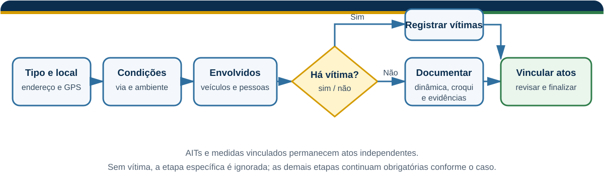

# Fluxo de sinistro

## Objetivo

Registrar um sinistro de trânsito com local, condições, veículos, pessoas, vítimas, dinâmica, croqui, evidências e atos relacionados.

## Pré-requisitos

- turno operacional aberto;
- localização e informações básicas do evento;
- autorização para tratar dados pessoais sensíveis;
- permissões de câmera, arquivos e localização, quando necessárias.

## Visão do fluxo

A etapa de vítimas só é preenchida quando aplicável. AITs e medidas relacionados seguem como atos independentes.

## Passo a passo

1. Selecione **Sinistro**.
2. Informe o tipo e a gravidade, como colisão, atropelamento, queda ou choque com objeto fixo.
3. Registre localização, endereço e coordenadas.
4. Informe pavimentação, clima, iluminação, sinalização e demais condições da via.
5. Adicione os veículos, incluindo placa, danos e eventual evasão.
6. Registre condutores, passageiros e testemunhas.
7. Se houver vítimas, informe classificação, atendimento e hospital.
8. Descreva a dinâmica e, se cabível, a hipótese preliminar.
9. Anexe ou produza croqui simples, documento ou mapa georreferenciado.
10. Adicione as evidências.
11. Relacione AITs e medidas administrativas.
12. Revise todos os dados e finalize.

[PLACEHOLDER — Imagem: início do fluxo de sinistro]

[PLACEHOLDER — Imagem: etapa de veículos/vítimas/croqui]

[PLACEHOLDER — Imagem: conclusão do sinistro]

## Resultado esperado

O registro recebe hash, entra na fila de sincronização e fica disponível para os sistemas relacionados a acidentes após o processamento correspondente.

## Observações

- O domínio possui onze passos antes do estado final: tipo, local, condições, veículos, pessoas, vítimas, dinâmica, croqui, evidência, vínculos e revisão.
- A etapa de vítimas é condicional; sem vítima, o percurso efetivo possui dez passos.
- São aceitos até seis veículos e quatro testemunhas.
- Os dados de vítimas exigem cuidado reforçado por serem informações pessoais sensíveis.
- AIT e medida vinculados continuam sendo atos próprios, com auditoria independente.
