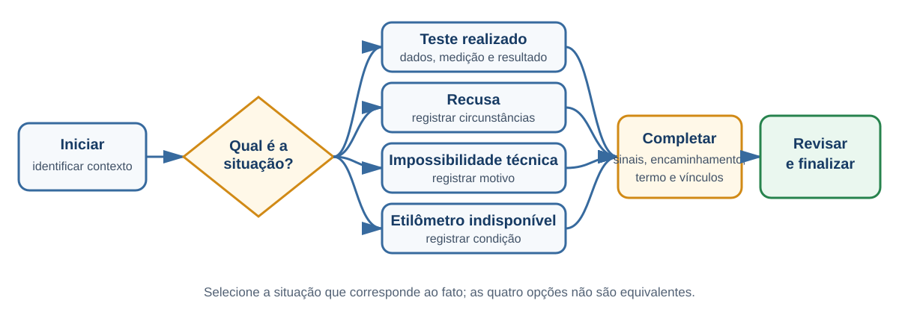

# Fluxo de alcoolemia

## Objetivo

Registrar o procedimento de alcoolemia, seu resultado, as circunstâncias da abordagem e os atos decorrentes.

## Pré-requisitos

- turno operacional aberto;
- pessoa e veículo identificados quando aplicável;
- etilômetro disponível e autorizado, se houver teste;
- dados do equipamento e da medição quando exigidos.

## Visão do fluxo

Teste realizado, recusa, impossibilidade técnica e indisponibilidade do etilômetro levam a registros diferentes antes das etapas comuns de conclusão.

## Passo a passo

1. Abra o procedimento de alcoolemia a partir do AIT, de uma medida sugerida ou do menu correspondente.
2. Selecione a situação:
   - teste realizado;
   - recusa do condutor;
   - impossibilidade técnica do aparelho;
   - indisponibilidade do etilômetro.
3. Quando houver teste, informe os dados e o resultado da medição.
4. Registre sinais psicomotores quando observados e solicitados.
5. Informe o encaminhamento adotado.
6. Gere ou complete o termo de alcoolemia.
7. Vincule os AITs e as medidas administrativas decorrentes.
8. Revise as informações e finalize.

[PLACEHOLDER — Imagem: início do fluxo de alcoolemia]

[PLACEHOLDER — Imagem: resultado/recusa e sinais psicomotores]

[PLACEHOLDER — Imagem: conclusão do procedimento de alcoolemia]

## Resultado esperado

O procedimento fica registrado e auditável, com seus vínculos para AITs e medidas administrativas, e segue para sincronização.

## Observações

- Recusa, impossibilidade técnica e indisponibilidade são situações distintas; selecione a que corresponde ao fato.
- A presença do indicador de etilômetro no aplicativo não comprova homologação física do equipamento.
- As etapas podem ser abertas dentro do componente de fluxo do AIT; isso não elimina suas regras próprias.
