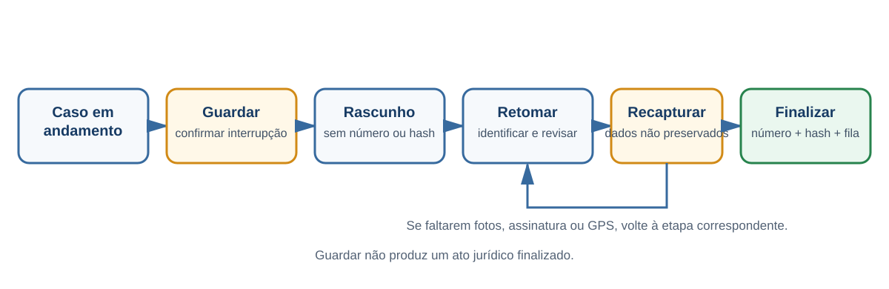

# Guardar e retomar casos

## Objetivo

Interromper temporariamente um atendimento e retomá-lo depois, sem tratar o caso guardado como ato jurídico finalizado.

## Pré-requisitos

- turno operacional aberto;
- caso iniciado e ainda não finalizado;
- motivo operacional para interromper o preenchimento.

## Visão do fluxo

O caso guardado é um rascunho. Somente a finalização produz número, hash e item na fila, quando aplicáveis.

## Passo a passo

1. No fluxo em andamento, selecione a opção de guardar ou salvar o caso.
2. Confirme a interrupção.
3. Atenda o próximo veículo ou execute outra atividade.
4. Para retomar, abra a lista de rascunhos ou casos guardados.
5. Selecione o caso correto pelos dados disponíveis.
6. Revise todas as etapas já preenchidas.
7. Recapture os dados não preservados.
8. Continue o fluxo, revise e finalize normalmente.

[PLACEHOLDER — Imagem: opção para guardar o caso]

[PLACEHOLDER — Imagem: lista de casos guardados]

[PLACEHOLDER — Imagem: caso retomado]

## Resultado esperado

O preenchimento é retomado e, somente depois da finalização, o ato recebe número quando aplicável, hash e item na fila de sincronização.

## Observações

- É possível manter vários casos guardados.
- Um caso de AIT guardado não é um AIT jurídico: não possui número, hash ou item de fila.
- Fotos e assinatura do caso de AIT não são preservadas e precisam ser recapturadas.
- Em remoção aguardando reboque, fotos gerais e GPS podem não sobreviver à retomada após morte do processo.
- Sempre confira a identidade do caso antes de continuar para evitar associação de dados ao atendimento errado.
