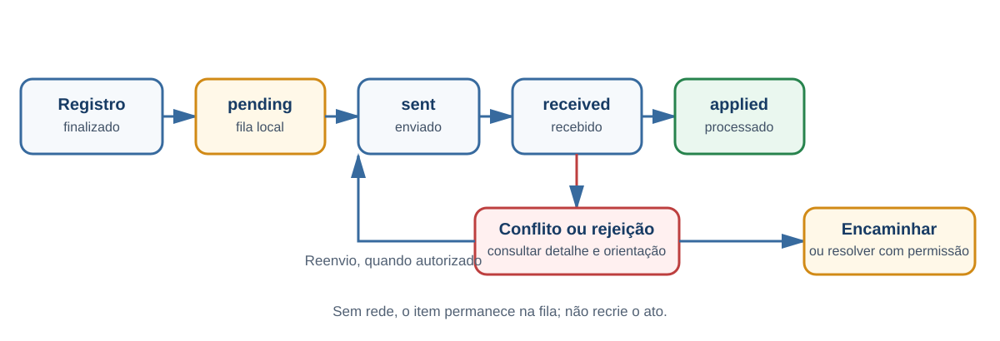

# Outros fluxos relevantes

## Consultas de veículo e condutor

### Objetivo

Consultar dados cadastrais e reaproveitar um resultado confirmado em AIT ou sinistro.

### Pré-requisitos

- placa, CPF ou CNH disponível;
- conectividade para consulta integrada ou justificativa para procedimento manual/offline.

### Passo a passo

1. Abra **Consultas**.
2. Escolha veículo ou condutor.
3. Informe o identificador solicitado.
4. Execute a consulta e confira o resultado.
5. Se houver divergência, revise as informações apresentadas.
6. Se o serviço estiver indisponível, use o preenchimento manual permitido e justifique.
7. Confirme o aproveitamento no AIT ou sinistro, quando aplicável.

### Resultado esperado

O resultado confirmado é apresentado e pode preencher o fluxo relacionado. A divergência veicular é informativa e não cria ato autônomo.

### Observações

As telas são implementadas, mas o sandbox não comprova homologação credenciada com RENAVAM ou RENACH.

[PLACEHOLDER — Imagem: consulta e resultado]

## Sincronização e conflitos

### Objetivo

Enviar registros à central e acompanhar processamento, rejeições, mídia e conflitos.

### Pré-requisitos

- registros finalizados na fila;
- conectividade para transmissão;
- permissão de supervisor para resoluções restritas.

### Visão do fluxo

Sem conectividade, o item permanece na fila local. Conflitos e rejeições devem ser tratados a partir do detalhe do item, conforme a permissão do usuário.

### Passo a passo

1. Abra **Sincronização**.
2. Consulte registros e mídias pendentes ou rejeitados.
3. Se houver rede, use a sincronização manual quando necessário.
4. Abra o detalhe do item para conferir estado, auditoria e possibilidade de reenvio.
5. Em conflito, consulte as resoluções autorizadas pela retaguarda.
6. Como agente de campo, encaminhe o caso para análise.
7. Como supervisor autorizado, aplique `device-wins` ou `server-wins` somente quando oferecido pela retaguarda e permitido para o tipo de registro.

### Resultado esperado

O item percorre os estados `pending`, `sent`, `received` e `applied`, ou recebe tratamento específico como `conflict`, `rejected` ou `concurrency-suspect`.

### Observações

- “Aguardando rede” é uma condição operacional, não um estado formal do registro.
- AIT formal não pode ser sobrescrito genericamente.
- Rejeição técnica retentável, rejeição de regra e suspeita de concorrência têm tratamentos diferentes.
- O processamento é idempotente para evitar duplicação decorrente de reenvio.

[PLACEHOLDER — Imagem: fila e detalhe de sincronização]

## Fiscalização sem autuação

### Objetivo

Registrar abordagem educativa, fiscalização sem infração, orientação ou bloqueio operacional.

### Pré-requisitos

- turno operacional aberto;
- tipo e resultado da interação conhecidos.

### Passo a passo

1. Abra a fiscalização complementar.
2. Escolha o tipo de interação.
3. Informe veículo e condutor se disponíveis.
4. Registre o resultado como orientado, liberado ou encaminhado.
5. Revise e conclua.

### Resultado esperado

A interação fica registrada sem gerar AIT.

### Observações

Veículo e condutor são opcionais nesse registro. Se for identificada infração, use o fluxo próprio de AIT.

## Fiscalização documental

### Objetivo

Verificar CRLV-e ou CNH Digital e registrar o resultado.

### Pré-requisitos

- turno operacional aberto;
- câmera disponível para leitura de QR Code, quando utilizada;
- documento apresentado ou condição de ausência conhecida.

### Passo a passo

1. Abra a fiscalização documental.
2. Leia o QR Code do CRLV-e ou da CNH Digital.
3. Classifique o documento como regular, ausente ou vencido.
4. Adicione foto opcional.
5. Conclua o registro.

### Resultado esperado

A fiscalização documental fica registrada para auditoria e sincronização.

### Observações

A leitura do QR Code não elimina a necessidade de conferir o documento e o resultado mostrado pelo aplicativo.

## Fiscalização de carga ou equipamento

### Objetivo

Registrar verificação de carga, equipamento, transporte especial ou peso/dimensão.

### Pré-requisitos

- turno operacional aberto;
- informações de carga, equipamento ou dimensões disponíveis;
- documentos que serão anexados identificados.

### Passo a passo

1. Escolha o tipo de fiscalização.
2. Informe peso e dimensões quando aplicável.
3. Anexe até três documentos.
4. Indique eventual medida administrativa.
5. Revise e conclua.

### Resultado esperado

A fiscalização e seus documentos ficam registrados e relacionados às providências adotadas.

### Observações

O fluxo aceita até três documentos. Uma medida administrativa indicada deve ser registrada no fluxo próprio.

## Encerramento do turno

### Objetivo

Conferir a produção, liquidar a numeração e encerrar a sessão operacional.

### Pré-requisitos

- atos revisados;
- fila e pendências conhecidas;
- falhas de bodycam comunicadas quando exigidas.

### Passo a passo

1. Abra o resumo do turno.
2. Confira viatura, equipe, operação e horário.
3. Revise AITs, medidas, sinistros e sincronização.
4. Confira números usados, devolvidos e retidos.
5. Revise a situação da bodycam.
6. Se houver comunicação devida, registre-a antes de prosseguir.
7. Confirme o encerramento.

### Resultado esperado

A faixa é liquidada, a sessão exclusiva é encerrada e o aplicativo retorna ao login. Após handoff autorizado, o resumo pode consolidar atos de mais de um aparelho.

### Observações

Quando a política exige bodycam e há comunicação pendente, a interface conduz primeiro ao registro da falha. Isso não invalida os atos já praticados, mas a omissão não deve ser tratada como encerramento normal.

[PLACEHOLDER — Imagem: conclusão de outro fluxo relevante]
