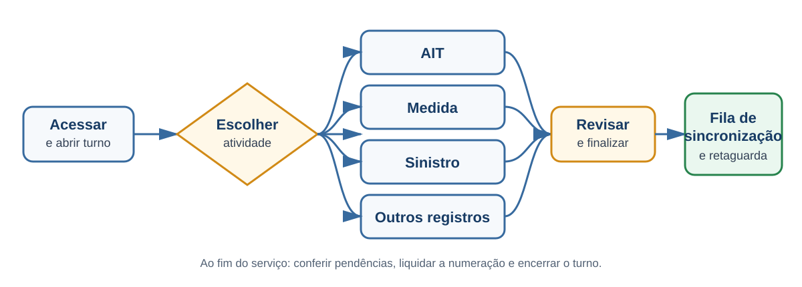

# Fluxos de trabalho

Cada procedimento deste capítulo segue a mesma estrutura: **Objetivo**, **Pré-requisitos**, **Passo a passo**, **Resultado esperado** e **Observações**.

## Fluxos principais

- [AIT](01-ait.md)
- [Medida administrativa](02-medida-administrativa.md)
- [Evidências](03-evidencias.md)
- [Sinistro](04-sinistro.md)
- [Alcoolemia](05-alcoolemia.md)
- [Assinatura e ciência](06-assinatura-e-ciencia.md)
- [Impressão](07-impressao.md)
- [Guardar e retomar casos](08-guardar-e-retomar-casos.md)
- [Outros fluxos relevantes](09-outros-fluxos.md)

Antes de iniciar, confirme que o turno e o contexto operacional estão ativos. Ao finalizar qualquer ato, confira a fila de sincronização.

## Visão geral da jornada

O diagrama apresenta o caminho comum. Cada atividade possui etapas e regras próprias, detalhadas nas páginas deste capítulo.
